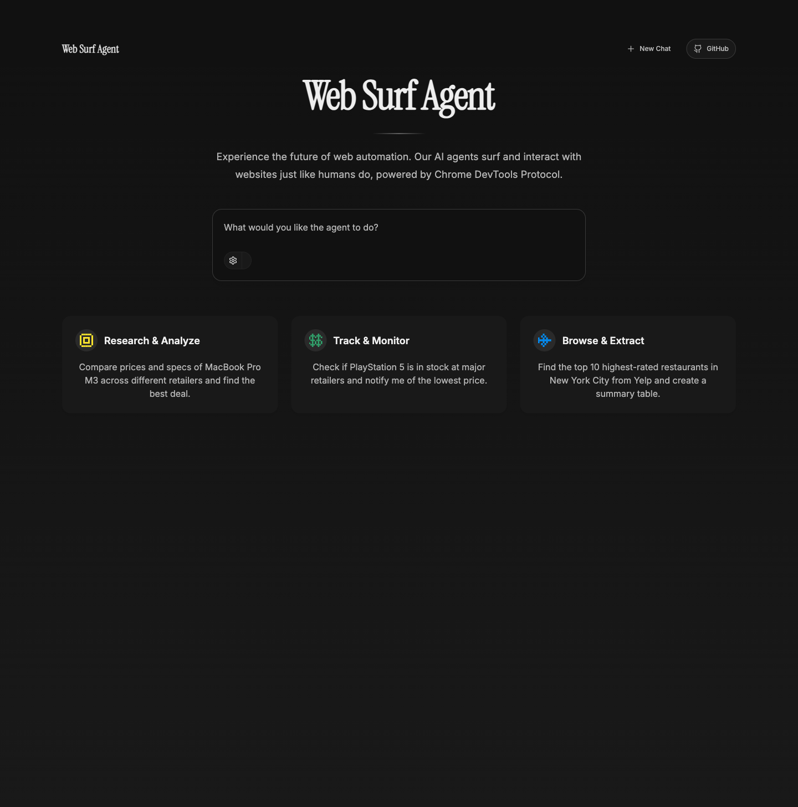

# Web Surf Agent

Web Surf Agent is an open playground for building and testing AI agents that browse real websites through Chrome DevTools Protocol (CDP).

It combines a Next.js frontend, a FastAPI backend, and multiple agent backends so you can inspect browser actions, compare providers, and demo web automation in a UI that is easier to share than raw scripts.



## Why it is useful

- Run browser-based agent experiments against a real Chrome session
- Compare model providers and agent behaviors in the same interface
- Inspect navigation, clicks, extraction, and workflow progress visually
- Prototype web-agent UX before investing in production infrastructure
- Demo browser automation ideas to teammates, users, or investors

## Who it is for

- AI engineers building browser agents
- Developers exploring CDP-based automation
- Teams validating web-task reliability across providers
- Hackers who want a reusable web-agent demo stack

## Tech stack

- Next.js 15
- FastAPI
- Chrome DevTools Protocol
- Tailwind CSS
- shadcn/ui
- Vercel AI SDK
- LangChain

## Quick start

### Prerequisites

- Node.js 18+
- Python 3.11+
- Google Chrome

### Installation

```bash
git clone https://github.com/cuongducle/web_agent.git
cd web_agent
npm install
python -m venv venv
source venv/bin/activate
pip install -r requirements.txt
cp .env.local.example .env.local
```

Update `.env.local` with the values you need. At minimum, local CDP usage expects:

```bash
API_URL=http://localhost:8000
CDP_WS_ENDPOINT=ws://localhost:9222
ANTHROPIC_API_KEY=your_anthropic_api_key_here
```

### Start Chrome with CDP enabled

Launch Chrome with remote debugging enabled so the agent can connect:

```bash
/Applications/Google\ Chrome.app/Contents/MacOS/Google\ Chrome --remote-debugging-port=9222
```

Then confirm your `.env.local` contains:

```bash
CDP_WS_ENDPOINT=ws://localhost:9222
```

### Run the app

```bash
npm run dev
```

This starts:

- Next.js on `http://localhost:3001`
- FastAPI on `http://localhost:8000`

Open [http://localhost:3001](http://localhost:3001).

### Windows note

Use:

```bash
npm run dev:win
```

This avoids the Playwright subprocess issue caused by the default Windows event loop during hot reload.

## Common use cases

- Test a web agent against your local Chrome instance
- Explore how an agent reacts to real page state
- Benchmark different providers on the same browsing task
- Extract structured data from websites
- Demo an AI browsing workflow with a cleaner UI

## Project structure

```text
app/         Next.js app router frontend
api/         FastAPI backend and agent plugins
components/  Shared UI components
monitor/     Optional backend health monitor
public/      Static assets and screenshots
```

## Launch-readiness improvements still worth adding

- Record a short demo GIF for the README and social posts
- Publish a hosted demo link in the hero section
- Add benchmark tasks with reproducible outputs
- Add architecture docs for plugin authors
- Add example prompts and comparison results

## Contributing

Issues and pull requests are welcome. If you want to improve agent reliability, add providers, or polish the UX, start with [CONTRIBUTING.md](CONTRIBUTING.md).

## Search terms this repo should rank for

- web agent
- web agent playground
- AI browser agent
- browser automation with CDP
- Chrome DevTools Protocol agent
- Next.js FastAPI browser automation
- browser agent UI
- AI web automation demo

## License

MIT. See [LICENSE](LICENSE).
